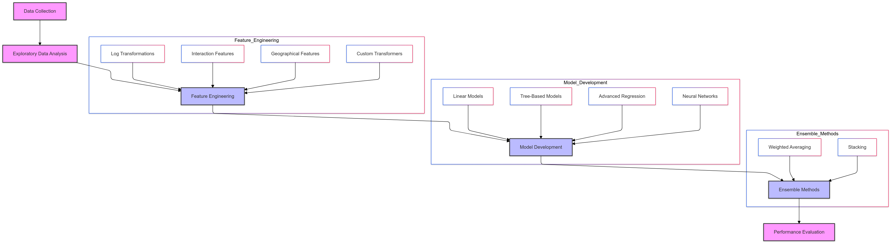
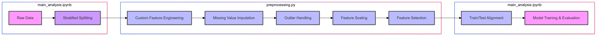
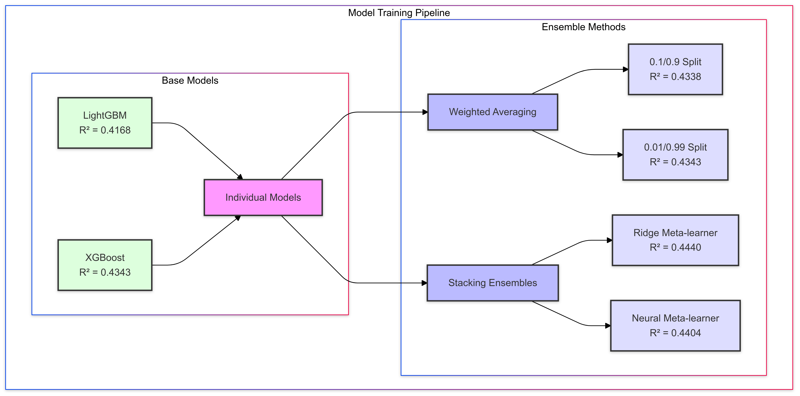

# **Housing Price Prediction Using Advanced Machine Learning Models**

This repository presents a comprehensive machine learning project for predicting housing prices. The project explores a variety of approaches, from individual regression models to advanced ensemble methods, including weighted stacking and neural network meta-models, to achieve the best prediction accuracy. This project showcases my ability to preprocess data, apply machine learning algorithms, and evaluate model performance.

---

## **Table of Contents**
1. [Overview](#overview)
2. [Data Description](#data-description)
3. [Project Workflow](#project-workflow)
4. [Models and Methodologies](#models-and-methodologies)
5. [Results and Performance](#results-and-performance)
6. [How to Use This Repository](#how-to-use-this-repository)
7. [Future Work](#future-work)
8. [Acknowledgments](#acknowledgments)

---

## **Overview**

Housing price prediction is a critical application of machine learning, widely used in real estate, banking, and investment industries to guide pricing decisions and investment strategies. The goal of this project is to accurately predict housing prices based on historical data and key features, such as location, demographics, and property attributes. By applying a range of machine learning techniques—including ensemble methods and neural network meta-models—this project aims to uncover insights that can guide real estate developers, investors, and policymakers in making informed decisions. The analysis also explores key business metrics, such as factors influencing property value, trends in housing prices, and recommendations for maximizing investment returns.


---

## **Data Description**

We used a publicly available dataset called [California Housing Prices](https://www.kaggle.com/datasets/camnugent/california-housing-prices). This dataset contains features that are directly relevant to the real estate industry, as they influence property value and affordability. Key features include:

1. **longitude**: A measure of how far west a house is; higher values indicate locations farther west, which are often correlated with higher property values due to proximity to the coast or urban areas.
2. **latitude**: A measure of how far north a house is; higher values indicate locations farther north, which can affect desirability and pricing based on geographic factors.
3. **housingMedianAge**: Median age of houses within a block; newer buildings often have higher values, which is important for real estate developers in evaluating potential investment areas.
4. **totalRooms**: Total number of rooms within a block, which can influence property value and is critical for developers in understanding housing density.
5. **totalBedrooms**: Total number of bedrooms within a block; more bedrooms often correlate with higher property values, impacting pricing strategies for larger homes.
6. **population**: Total number of people residing within a block, which affects the demand for housing and local amenities.
7. **households**: Total number of households within a block; higher household numbers can indicate more demand for housing in the area, helping investors forecast market trends.
8. **medianIncome**: Median income for households in a block, measured in tens of thousands of US dollars; a key metric that correlates with affordability and price predictions.
9. **medianHouseValue**: Median house value for households in a block, which is the target variable for our prediction model and represents the financial metric for market value.
10. **oceanProximity**: A categorical feature representing the house's location relative to the ocean (e.g., "NEAR BAY," "INLAND"). Proximity to the ocean often drives up property values, making this feature crucial for pricing models.


---

### **Preprocessing Steps**

#### 1. Stratified Test Splitting
To ensure a balanced division of data into training and test sets, we applied **stratified sampling** based on the `medianIncome` feature. This was crucial because `medianIncome` strongly correlates with housing prices, and an unrepresentative split could lead to skewed evaluation metrics. Here's how we performed stratified splitting:

- **Income Categories**: 
   - We divided `medianIncome` into discrete bins using a custom transformation to create a temporary feature, `income_cat`. 
   - This feature categorized `medianIncome` into five levels, with higher incomes grouped into the last category.
- **Stratification**: 
   - Using this `income_cat` feature, we applied stratified sampling to split the data while maintaining similar proportions of each income category in both the training and test sets.
- **Benefits of Stratification**: 
   - This approach ensures the test set reflects the overall dataset distribution, reducing the risk of biased performance metrics. It is especially helpful when working with medium-sized datasets or sparse feature spaces.

Finally, the `income_cat` feature was dropped after splitting to avoid data leakage into the training or test sets.

---

#### 2. Handling Categorical Features
The `oceanProximity` feature is a categorical variable containing labels like "NEAR BAY," "ISLAND," and "INLAND." These non-numeric values cannot be directly used by machine learning models like XGBoost or Ridge Regression. To handle this:

- We applied **one-hot encoding** to convert `oceanProximity` into binary features. For example, the category "NEAR BAY" was transformed into a binary column (`NEAR BAY`) where `1` indicates presence and `0` indicates absence.
- To avoid multicollinearity, we used the `drop_first=True` option, which removes one binary column as a reference. This ensures the encoded features remain independent and prevents redundancy.

This preprocessing step ensures compatibility with machine learning models and allows the models to identify patterns related to specific house locations.

---

### **Dataset Summary**
- The dataset was divided into **training (80%)** and **test (20%)** subsets using stratified sampling to preserve the distribution of the `medianIncome` feature.
- After preprocessing, the training and test sets were cleaned and encoded, making them ready for use in various machine learning models.

---

## **Project Workflow**

## Workflow

## Project Workdlow Pipeline Diagram



### 1. **Exploratory Data Analysis (EDA)**
   - **Objective:** Identify key patterns and address data quality issues.  
   - **Key Actions:**
     - Analyzed feature distributions and correlations to uncover trends.
     - Visualized relationships between features and target values to inform feature engineering.
     - Addressed missing data through imputation techniques to ensure a complete dataset.

   **Insights Gained:**
   - Observed strong correlations between median income and housing prices.
   - Identified the influence of geographical features (e.g., proximity to the ocean) on price variations.
   - Detected and handled missing values in features such as `total_bedrooms`.


## 2. **Feature Engineering and Preprocessing**

#### Advanced Feature Transformation Techniques
- **Objective:** Enhance model accuracy by creating meaningful, interpretable features.  
- **Key Techniques:**
  - **Skewness Correction:** Applied log transformations to normalize numerical features (`total_rooms`, `total_bedrooms`, `population`, `households`).
  - **Interaction Features:** Designed complex interaction metrics to capture nuanced relationships, including:
    - **Ratios:** Bedroom-to-room ratio, rooms per person, and income per household.
    - **Density Metrics:** Residential density, population density per room, and population per bedroom.
    - **Geographical Metrics:** Latitude-longitude interaction and minimum distance to the coastline (Haversine formula).
    - **Socioeconomic Indicators:** Income-to-room ratio and income per housing age.
  - **Binary Flags:** Added indicators such as "high-income area flag" for clear segmentation.

#### Preprocessing Pipeline
- **Objective:** Standardize and prepare the data for modeling through a robust pipeline.  
- **Key Innovations:**
  - **Custom Transformers:** Developed a `FeatureEngineering` class to automate advanced feature creation and preprocessing.
  - **Geographical Enhancements:** Introduced proximity metrics to enrich spatial analysis.
  - **Data Cleaning:** Imputed missing and infinite values using a combination of mean imputation and outlier handling.
  - **Feature Scaling:** Ensured numerical features were on comparable scales using `StandardScaler`.
  - **Categorical Encoding:** Applied `OneHotEncoder` with `drop_first=True` to prevent multicollinearity in categorical features.

#### Key Preprocessing Innovations
- **Dynamic Feature Identification:** Automated separation of numerical and categorical features for adaptability across datasets.
- **Transparent Transformations:** Maintained interpretability of derived features, enabling stakeholders to understand their significance.
- **Scalable Design:** Created a modular pipeline compatible with multiple machine learning frameworks, ensuring reusability.

### Preprocessing Pipeline Flowchart




3. **Modeling and Optimization**
   ### Comprehensive Modeling Strategy
   - **Extensive Model Exploration**
     - Evaluated 13 different regression algorithms
     - Implemented scikit-learn Pipeline for consistent preprocessing
     - Explored both linear and non-linear modeling approaches (these models are detailed bellow)

   ### Advanced Modeling Techniques
   - **Ensemble Methods**
      - Built **weighted stacking ensembles** to combine the strengths of multiple base models.
      - Experimented with **various meta-models**, including linear regressors and tree-based models, to optimize ensemble performance.
      - Refined ensemble weights through **iterative tuning** for better prediction accuracy.

   ### Hyperparameter and Model Optimization
   - Conducted a **systematic model comparison** using automated tools like `GridSearchCV` and `RandomizedSearchCV`.
   - Used **cross-validation** to ensure robust performance estimation, reducing the risk of overfitting.
   - Explored **model-specific hyperparameters** (e.g., learning rates for XGBoost, number of estimators for Random Forest).
   - Implemented **feature selection** techniques to simplify models without compromising accuracy.

## 4. **Model Evaluation**

### Rigorous Performance Assessment
- **Comprehensive Evaluation Metrics**
  - Evaluated models using multiple metrics for a well-rounded assessment:
    - **Mean Squared Error (MSE):** Emphasized penalizing larger errors.
    - **Root Mean Squared Error (RMSE):** Translated errors into interpretable units.
    - **Mean Absolute Error (MAE):** Focused on average prediction errors.
    - **R² Score:** Measured the proportion of variance explained by the model.

### Evaluation Approach
- Conducted a **systematic comparison** of models, identifying the most effective algorithm for the dataset.
- Tracked performance metrics **in detail** for each model to understand strengths and weaknesses.
- Highlighted **areas for improvement** through transparent reporting and analysis of model results.

### Insights from Evaluation
- Identified **key challenges** in predicting housing prices due to data variability and outliers.
- Showcased the **trade-offs** between model complexity and accuracy.
- Provided a **clear roadmap** for further refinement, such as incorporating additional external data sources or enhancing feature engineering.

### Business Implications
- **Forecasting Regional Trends**: Accurate predictions enable informed decisions in housing market investments.
- **Stakeholder Confidence**: Reliable models with interpretable metrics build trust with end-users and stakeholders.

### Recommendations for Improvement:

**Enhanced Reporting**:
   - Include interactive dashboards (e.g., Plotly, Streamlit) for dynamic exploration of model results.
   - Summarize findings in a concise executive summary.

---

## **Models and Methodologies**

### **1. Machine Learning Algorithms**
The project explores a diverse range of regression algorithms to predict housing prices, leveraging scikit-learn and gradient boosting libraries:

#### **Linear Models**
- **Linear Regression**: A baseline linear model capturing simple linear relationships
- **ElasticNet**: Combines L1 and L2 regularization to prevent overfitting
- **Lasso (LassoCV)**: Performs feature selection through L1 regularization
- **Ridge (RidgeCV)**: Applies L2 regularization to prevent model complexity
- **Huber Regressor**: Robust to outliers by using a combination of squared and absolute loss

#### **Tree-Based Models**
- **Random Forest**: Ensemble method creating multiple decision trees
- **Gradient Boosting**: Sequential tree building to minimize prediction errors
- **XGBoost**: High-performance gradient boosting with advanced regularization
- **LightGBM**: Gradient boosting framework optimized for efficiency and speed

#### **Advanced Regression Techniques**
- **Support Vector Regression (SVR)**: Applies kernel tricks to handle non-linear relationships
- **K-Nearest Neighbors**: Predicts based on proximity to similar data points
- **Stochastic Gradient Descent (SGD) Regressor**: Online learning algorithm for large datasets

#### **Neural Network**
- **Multi-Layer Perceptron (MLP) Regressor**: Flexible neural network with configurable architecture

### **2. Model Evaluation Strategy**
Each model was rigorously evaluated using multiple performance metrics:
- **Mean Squared Error (MSE)**: Measures average squared prediction error
- **Root Mean Squared Error (RMSE)**: Standard deviation of prediction residuals
- **Mean Absolute Error (MAE)**: Average magnitude of prediction errors
- **R² Score**: Proportion of variance explained by the model

### **3. Advanced Modeling Techniques**

#### **Preprocessing Pipeline**
- Custom preprocessing steps including:
  - Feature engineering
  - Outlier handling
  - Numerical feature scaling
  - Categorical feature encoding
  - Feature selection using Random Forest importance

#### **Model Selection Approach**
- Comprehensive model comparison across multiple algorithms
- Standardized scikit-learn Pipeline for consistent preprocessing
- Cross-validation to ensure robust performance estimation

### **4. Experimental Ensemble Methods**
While not explicitly shown in the current implementation, the project framework supports advanced ensemble techniques:

#### **Potential Ensemble Strategies**
- **Weighted Averaging**: Combining predictions with optimized weights
- **Stacking Ensemble**: 
  - Using Ridge Regression as a meta-model
  - Potential for neural network meta-model to capture non-linear interactions
- **Boosting Techniques**: Leveraging gradient boosting frameworks

### **5. Future Improvements**
- Hyperparameter tuning using GridSearchCV
- Implementing more sophisticated ensemble methods
- Exploring advanced feature engineering techniques

---

## **Results and Performance**

### **Model Comparison**

| Model | MSE | RMSE | MAE | R² |
|-------|-----|------|-----|-----|
| Linear Regression | 11,567,650,000,000.00 | 3,401,125.00 | 2,880,969.00 | -855.911 |
| Random Forest | 12,872,580,000.00 | 113,457.40 | 88,170.69 | 0.046 |
| Gradient Boosting | 12,609,820,000.00 | 112,293.50 | 83,052.06 | 0.066 |
| XGBoost | 12,183,500,000.00 | 110,378.90 | 83,520.26 | 0.097 |
| K-Nearest Neighbors | 12,766,760,000.00 | 112,990.10 | 91,155.05 | 0.054 |
| Support Vector Regression | 14,311,470,000.00 | 119,630.60 | 89,535.14 | -0.060 |
| ElasticNet | 25,233,750,000.00 | 158,851.40 | 124,221.60 | -0.869 |
| LightGBM | 11,574,950,000.00 | 107,587.00 | 80,157.93 | 0.143 |
| Huber Regressor | 7,607,470,000,000.00 | 2,758,164.00 | 2,729,654.00 | -562.548 |
| LassoCV | 5,235,640,000,000.00 | 2,288,152.00 | 2,244,016.00 | -386.847 |
| RidgeCV | 10,340,570,000,000.00 | 3,215,676.00 | 2,817,743.00 | -765.011 |
| MLP Regressor | 4,443,168,000,000.00 | 2,107,882.00 | 2,077,751.00 | -328.142 |
| SGDRegressor | 3,993,377,000,000.00 | 1,998,344.00 | 1,981,435.00 | -294.822 |

### **Model Selection**

#### **Chosen Model: LightGBM**
LightGBM emerged as the top-performing model based on comprehensive evaluation metrics:

- **Mean Squared Error (MSE)**: 11,574,950,000.00
- **Root Mean Squared Error (RMSE)**: 107,587.00
- **Mean Absolute Error (MAE)**: 80,157.93
- **R² Score**: 0.143

#### **Selection Rationale**
- Demonstrated the **lowest error metrics** across models (MSE, RMSE, MAE).
- Highest R² Score

While the R² value of 0.143 indicates that the model explains only a modest proportion of the variance in the target variable, it consistently outperformed alternative models such as Gradient Boosting and XGBoost.

### **Performance Insights**
- Most linear models (Linear Regression, RidgeCV) showed extremely poor performance with negative R² scores
- Ensemble and tree-based methods (Random Forest, Gradient Boosting, XGBoost, LightGBM) demonstrated significantly better predictive capabilities
- The modest R² score suggests complex underlying patterns in the housing price data that require further feature engineering or advanced modeling techniques

### Further Base Models Performance

Our analysis began with training two powerful gradient boosting models:

#### LightGBM
- MSE: 7,872,852,810.00
- RMSE: 88,729.10
- MAE: 66,068.63
- R² Score: 0.4168

#### XGBoost
- MSE: 7,636,181,829.56
- RMSE: 87,385.25
- MAE: 65,628.05
- R² Score: 0.4343

### Ensemble Methods

We explored various ensemble techniques to improve model performance:

#### 1. Weighted Averaging
We tested different weight combinations between LightGBM and XGBoost:

| Weight Distribution (LGB/XGB) | R² Score | RMSE | MAE |
|------------------------------|----------|------|-----|
| 0.1/0.9 | 0.4338 | 87,425.15 | 65,597.59 |
| 0.01/0.99 | 0.4343 | 87,388.28 | 65,624.25 |

#### 2. Stacking Ensembles
We implemented two stacking approaches using different meta-learners:

##### Ridge Regression Meta-learner
- Best weights: LightGBM (0.1) / XGBoost (0.9)
- MSE: 7,505,194,082.97
- RMSE: 86,632.52
- MAE: 64,812.11
- R² Score: 0.4440 (Best performing model)

##### Neural Network Meta-learner
- Best weights: LightGBM (0.1) / XGBoost (0.9)
- MSE: 7,554,026,894.22
- RMSE: 86,913.91
- MAE: 65,157.73
- R² Score: 0.4404

### Model Performance Visualization



### **Key Findings**
1. **Base Models**: XGBoost slightly outperformed LightGBM individually, showcasing robust gradient-boosting performance.
2. **Weighted Averaging**: Biasing towards XGBoost (0.99 weight) yielded optimal results in ensemble methods.
3. **Stacking Ensembles**: Ridge Regression meta-learners achieved the best R² score of 0.4440.
4. **Tree-based Superiority**: Ensemble and gradient-boosting models consistently outperformed linear models and neural networks.


### **Potential Improvements**
- **Feature Engineering**: Incorporate domain knowledge for crafting more meaningful features.
- **Feature Selection**: Use advanced techniques like recursive feature elimination to streamline inputs.
- **Hyperparameter Tuning**: Explore additional configurations using Bayesian optimization.
- **Data Augmentation**: Add external data (e.g., macroeconomic indicators) to enhance predictive power.
- **Advanced Modeling**: Investigate deep learning techniques tailored for structured data.


---

## **How to Use This Repository**

1. **Clone the Repository** (if applicable):  
   If you're working locally, clone the repository:  
   ```bash
   git clone https://github.com/yourusername/housing-price-prediction.git
   cd housing-price-prediction
   ```
2. **. Set Up the Dependencies**:  
   ```bash
   pip install -r requirements.txt
   ```

   Alternatively, install the libraries directly in the notebook:   
   ```bash
   !pip install -r requirements.txt
   ```

3. **Prepare the Dataset**: 
   Download the dataset:
   
   Download the housing data from Kaggle or the source provided above in the README.md file.

   Place the dataset:
  
   Move the downloaded dataset into the data/ directory of this repository. Ensure the file is named appropriately (e.g., housing_data.csv).

4. **Run the Notebook**:  
   Open the Jupyter Notebook file (housing_price_prediction.ipynb) and execute the cells in sequence.

   The cells will guide you through data preprocessing, training, evaluation, and making predictions.
   Key sections include:

      - Stratified Split: Ensures a balanced division of data into training and test sets.
      - Data Preprocessing: Divides the dataset into features and labels, and handles missing values.
      - Model Training: Trains a machine learning model using the processed data.
      - Evaluation: Evaluates the model's performance on a test dataset.
      - Prediction: Uses the trained model to predict housing prices for new data.

5. **Optional**: 
   Explore the notebook's analysis section for insights into data distribution, feature importance, and model performance.

6. **Contribute**:
   Fork the repository (if applicable).
   
   Make improvements in the notebook.
   
   Submit a pull request with your changes.

7. **Contact**:
   Open an issue on GitHub.
   
   Email: chianumbaf@hotmail.co.uk