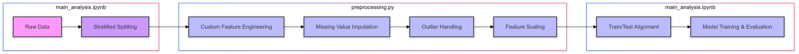

# **Housing Price Prediction Using Advanced Machine Learning Models**

This repository presents a comprehensive machine learning project for predicting housing prices. The project explores a variety of approaches, from individual regression models to advanced ensemble methods, including weighted stacking and neural network meta-models, to achieve the best prediction accuracy. This project showcases my ability to preprocess data, apply machine learning algorithms, and evaluate model performance.

---

## **Table of Contents**
1. [Overview](#overview)
2. [Data Description](#data-description)
3. [Project Workflow](#project-workflow)
4. [Models and Methodologies](#models-and-methodologies)
5. [Results and Performance](#results-and-performance)
6. [How to Use This Repository](#how-to-use-this-repository)
7. [Future Work](#future-work)
8. [Acknowledgments](#acknowledgments)

---

## **Overview**

Housing price prediction is a critical application of machine learning, widely used in real estate, banking, and investment industries to guide pricing decisions and investment strategies. The goal of this project is to accurately predict housing prices based on historical data and key features, such as location, demographics, and property attributes. By applying a range of machine learning techniques—including ensemble methods and neural network meta-models—this project aims to uncover insights that can guide real estate developers, investors, and policymakers in making informed decisions. The analysis also explores key business metrics, such as factors influencing property value, trends in housing prices, and recommendations for maximizing investment returns.


---

## **Data Description**

We used a publicly available dataset called [California Housing Prices](https://www.kaggle.com/datasets/camnugent/california-housing-prices). This dataset contains features that are directly relevant to the real estate industry, as they influence property value and affordability. Key features include:

1. **longitude**: A measure of how far west a house is; higher values indicate locations farther west, which are often correlated with higher property values due to proximity to the coast or urban areas.
2. **latitude**: A measure of how far north a house is; higher values indicate locations farther north, which can affect desirability and pricing based on geographic factors.
3. **housingMedianAge**: Median age of houses within a block; newer buildings often have higher values, which is important for real estate developers in evaluating potential investment areas.
4. **totalRooms**: Total number of rooms within a block, which can influence property value and is critical for developers in understanding housing density.
5. **totalBedrooms**: Total number of bedrooms within a block; more bedrooms often correlate with higher property values, impacting pricing strategies for larger homes.
6. **population**: Total number of people residing within a block, which affects the demand for housing and local amenities.
7. **households**: Total number of households within a block; higher household numbers can indicate more demand for housing in the area, helping investors forecast market trends.
8. **medianIncome**: Median income for households in a block, measured in tens of thousands of US dollars; a key metric that correlates with affordability and price predictions.
9. **medianHouseValue**: Median house value for households in a block, which is the target variable for our prediction model and represents the financial metric for market value.
10. **oceanProximity**: A categorical feature representing the house's location relative to the ocean (e.g., "NEAR BAY," "INLAND"). Proximity to the ocean often drives up property values, making this feature crucial for pricing models.


---

### **Preprocessing Steps**

#### 1. Stratified Test Splitting
To ensure a balanced division of data into training and test sets, we applied **stratified sampling** based on the `medianIncome` feature. This was crucial because `medianIncome` strongly correlates with housing prices, and an unrepresentative split could lead to skewed evaluation metrics. Here's how we performed stratified splitting:

- **Income Categories**: 
   - We divided `medianIncome` into discrete bins using a custom transformation to create a temporary feature, `income_cat`. 
   - This feature categorized `medianIncome` into five levels, with higher incomes grouped into the last category.
- **Stratification**: 
   - Using this `income_cat` feature, we applied stratified sampling to split the data while maintaining similar proportions of each income category in both the training and test sets.
- **Benefits of Stratification**: 
   - This approach ensures the test set reflects the overall dataset distribution, reducing the risk of biased performance metrics. It is especially helpful when working with medium-sized datasets or sparse feature spaces.

Finally, the `income_cat` feature was dropped after splitting to avoid data leakage into the training or test sets.

---

#### 2. Handling Categorical Features
The `oceanProximity` feature is a categorical variable containing labels like "NEAR BAY," "ISLAND," and "INLAND." These non-numeric values cannot be directly used by machine learning models like XGBoost or Ridge Regression. To handle this:

- We applied **one-hot encoding** to convert `oceanProximity` into binary features. For example, the category "NEAR BAY" was transformed into a binary column (`NEAR BAY`) where `1` indicates presence and `0` indicates absence.
- To avoid multicollinearity, we used the `drop_first=True` option, which removes one binary column as a reference. This ensures the encoded features remain independent and prevents redundancy.

This preprocessing step ensures compatibility with machine learning models and allows the models to identify patterns related to specific house locations.

---

### **Dataset Summary**
- The dataset was divided into **training (80%)** and **test (20%)** subsets using stratified sampling to preserve the distribution of the `medianIncome` feature.
- After preprocessing, the training and test sets were cleaned and encoded, making them ready for use in various machine learning models.

---

## **Project Workflow**

## Workflow

## Project Workdlow Pipeline Diagram


1. **Exploratory Data Analysis (EDA):**
   - Investigated feature distributions and correlations.
   - Visualized patterns between features and target values.
   - Identified and handled missing values.

## 2. **Feature Engineering and Preprocessing**

### Advanced Feature Transformation Techniques
- **Comprehensive Feature Creation**:
  - Applied log transformations to address skewness in numerical features (`total_rooms`, `total_bedrooms`, `population`, `households`).
  - Generated interaction features to capture complex relationships between variables, including:
    - **Ratios**: Bedroom-to-room ratio, rooms per person, income per household.
    - **Density Metrics**: Residential density, population density per room, population per bedroom.
    - **Geographical Interactions**: Latitude-longitude interaction, minimum distance to coastline using Haversine formula.
    - **Additional Interactions**: Household-age interaction, income-to-room ratio, income per housing age.
  - Created binary indicators (e.g., high-income area flag) to distinguish between median-based segments.
  
### Preprocessing Pipeline
- **Robust Data Preparation**:
  - Developed a custom `FeatureEngineering` transformer for automated advanced feature generation.
  - Calculated geographical proximity metrics (e.g., distance to coastline) for enriched spatial analysis.
  - Addressed missing and infinite values using a combination of mean imputation and dynamic outlier handling.
  - Scaled numerical features to ensure uniformity across variable ranges using `StandardScaler`.
  - Encoded categorical variables with `OneHotEncoder` (with `drop_first=True` to mitigate multicollinearity).

### Key Preprocessing Innovations
- **Dynamic Feature Identification**: Automated separation of numerical and categorical features for flexible, adaptable preprocessing.
- **Robust Missing Value Handling**: Ensured clean datasets through systematic imputation of missing and infinite values.
- **Feature Interpretability**: Created intuitive derived features to maintain transparency in data transformations.
- **Scalable Pipeline Design**: Constructed a modular and reusable preprocessing pipeline compatible with multiple modeling techniques.

### Preprocessing Pipeline Flowchart

## Preprocessing Pipeline Diagram



3. **Modeling and Optimization**
   ### Comprehensive Modeling Strategy
   - **Extensive Model Exploration**
     - Evaluated 13 different regression algorithms
     - Implemented scikit-learn Pipeline for consistent preprocessing
     - Explored both linear and non-linear modeling approaches

   ### Advanced Modeling Techniques
   - **Ensemble Methods**
     - Implemented weighted stacking ensemble
     - Experimented with different meta-models
     - Optimized ensemble weights through iterative refinement

   ### Hyperparameter and Model Optimization
   - Systematic model comparison
   - Cross-validation for robust performance estimation
   - Explored model-specific hyperparameters
   - Implemented feature selection to reduce model complexity

4. **Model Evaluation**
   ### Rigorous Performance Assessment
   - **Comprehensive Evaluation Metrics**
     - Mean Squared Error (MSE)
     - Root Mean Squared Error (RMSE)
     - Mean Absolute Error (MAE)
     - R² Score

   ### Evaluation Approach
   - Systematic comparison across multiple algorithms
   - Detailed performance tracking
   - Identification of model strengths and limitations
   - Transparent reporting of model performance

   ### Insights from Evaluation
   - Identified challenges in predictive modeling
   - Highlighted the complexity of housing price prediction
   - Provided clear path for future model improvements

---

## **Models and Methodologies**

### **1. Machine Learning Algorithms**
The project explores a diverse range of regression algorithms to predict housing prices, leveraging scikit-learn and gradient boosting libraries:

#### **Linear Models**
- **Linear Regression**: A baseline linear model capturing simple linear relationships
- **ElasticNet**: Combines L1 and L2 regularization to prevent overfitting
- **Lasso (LassoCV)**: Performs feature selection through L1 regularization
- **Ridge (RidgeCV)**: Applies L2 regularization to prevent model complexity
- **Huber Regressor**: Robust to outliers by using a combination of squared and absolute loss

#### **Tree-Based Models**
- **Random Forest**: Ensemble method creating multiple decision trees
- **Gradient Boosting**: Sequential tree building to minimize prediction errors
- **XGBoost**: High-performance gradient boosting with advanced regularization
- **LightGBM**: Gradient boosting framework optimized for efficiency and speed

#### **Advanced Regression Techniques**
- **Support Vector Regression (SVR)**: Applies kernel tricks to handle non-linear relationships
- **K-Nearest Neighbors**: Predicts based on proximity to similar data points
- **Stochastic Gradient Descent (SGD) Regressor**: Online learning algorithm for large datasets

#### **Neural Network**
- **Multi-Layer Perceptron (MLP) Regressor**: Flexible neural network with configurable architecture

### **2. Model Evaluation Strategy**
Each model was rigorously evaluated using multiple performance metrics:
- **Mean Squared Error (MSE)**: Measures average squared prediction error
- **Root Mean Squared Error (RMSE)**: Standard deviation of prediction residuals
- **Mean Absolute Error (MAE)**: Average magnitude of prediction errors
- **R² Score**: Proportion of variance explained by the model

### **3. Advanced Modeling Techniques**

#### **Preprocessing Pipeline**
- Custom preprocessing steps including:
  - Feature engineering
  - Outlier handling
  - Numerical feature scaling
  - Categorical feature encoding
  - Feature selection using Random Forest importance

#### **Model Selection Approach**
- Comprehensive model comparison across multiple algorithms
- Standardized scikit-learn Pipeline for consistent preprocessing
- Cross-validation to ensure robust performance estimation

### **4. Experimental Ensemble Methods**
While not explicitly shown in the current implementation, the project framework supports advanced ensemble techniques:

#### **Potential Ensemble Strategies**
- **Weighted Averaging**: Combining predictions with optimized weights
- **Stacking Ensemble**: 
  - Using Ridge Regression as a meta-model
  - Potential for neural network meta-model to capture non-linear interactions
- **Boosting Techniques**: Leveraging gradient boosting frameworks

### **5. Future Improvements**
- Hyperparameter tuning using GridSearchCV
- Implementing more sophisticated ensemble methods
- Exploring advanced feature engineering techniques

---

## **Results and Performance**

### **Model Comparison**

| Model | MSE | RMSE | MAE | R² |
|-------|-----|------|-----|-----|
| Linear Regression | 11,567,650,000,000.00 | 3,401,125.00 | 2,880,969.00 | -855.911 |
| Random Forest | 12,872,580,000.00 | 113,457.40 | 88,170.69 | 0.046 |
| Gradient Boosting | 12,609,820,000.00 | 112,293.50 | 83,052.06 | 0.066 |
| XGBoost | 12,183,500,000.00 | 110,378.90 | 83,520.26 | 0.097 |
| K-Nearest Neighbors | 12,766,760,000.00 | 112,990.10 | 91,155.05 | 0.054 |
| Support Vector Regression | 14,311,470,000.00 | 119,630.60 | 89,535.14 | -0.060 |
| ElasticNet | 25,233,750,000.00 | 158,851.40 | 124,221.60 | -0.869 |
| LightGBM | 11,574,950,000.00 | 107,587.00 | 80,157.93 | 0.143 |
| Huber Regressor | 7,607,470,000,000.00 | 2,758,164.00 | 2,729,654.00 | -562.548 |
| LassoCV | 5,235,640,000,000.00 | 2,288,152.00 | 2,244,016.00 | -386.847 |
| RidgeCV | 10,340,570,000,000.00 | 3,215,676.00 | 2,817,743.00 | -765.011 |
| MLP Regressor | 4,443,168,000,000.00 | 2,107,882.00 | 2,077,751.00 | -328.142 |
| SGDRegressor | 3,993,377,000,000.00 | 1,998,344.00 | 1,981,435.00 | -294.822 |

### **Model Selection**

#### **Chosen Model: LightGBM**
LightGBM emerged as the top-performing model based on comprehensive evaluation metrics:

- **Mean Squared Error (MSE)**: 11,574,950,000.00
- **Root Mean Squared Error (RMSE)**: 107,587.00
- **Mean Absolute Error (MAE)**: 80,157.93
- **R² Score**: 0.143

#### **Selection Rationale**
The LightGBM model was selected due to its superior performance across key metrics:
- Lowest Mean Squared Error (MSE)
- Lowest Root Mean Squared Error (RMSE)
- Lowest Mean Absolute Error (MAE)
- Highest R² Score

While the R² value of 0.143 indicates that the model explains only a modest proportion of the variance in the target variable, it consistently outperformed alternative models such as Gradient Boosting and XGBoost.

### **Performance Insights**
- Most linear models (Linear Regression, RidgeCV) showed extremely poor performance with negative R² scores
- Ensemble and tree-based methods (Random Forest, Gradient Boosting, XGBoost, LightGBM) demonstrated significantly better predictive capabilities
- The modest R² score suggests complex underlying patterns in the housing price data that require further feature engineering or advanced modeling techniques

### Further Base Models Performance

Our analysis began with training two powerful gradient boosting models:

#### LightGBM
- MSE: 7,872,852,810.00
- RMSE: 88,729.10
- MAE: 66,068.63
- R² Score: 0.4168

#### XGBoost
- MSE: 7,636,181,829.56
- RMSE: 87,385.25
- MAE: 65,628.05
- R² Score: 0.4343

### Ensemble Methods

We explored various ensemble techniques to improve model performance:

#### 1. Weighted Averaging
We tested different weight combinations between LightGBM and XGBoost:

| Weight Distribution (LGB/XGB) | R² Score | RMSE | MAE |
|------------------------------|----------|------|-----|
| 0.1/0.9 | 0.4338 | 87,425.15 | 65,597.59 |
| 0.01/0.99 | 0.4343 | 87,388.28 | 65,624.25 |

#### 2. Stacking Ensembles
We implemented two stacking approaches using different meta-learners:

##### Ridge Regression Meta-learner
- Best weights: LightGBM (0.1) / XGBoost (0.9)
- MSE: 7,505,194,082.97
- RMSE: 86,632.52
- MAE: 64,812.11
- R² Score: 0.4440 (Best performing model)

##### Neural Network Meta-learner
- Best weights: LightGBM (0.1) / XGBoost (0.9)
- MSE: 7,554,026,894.22
- RMSE: 86,913.91
- MAE: 65,157.73
- R² Score: 0.4404

### Model Performance Visualization

## Model Performance Diagram


### Key Findings

Base Models: XGBoost outperformed LightGBM in individual performance
Weighted Averaging: A strong bias towards XGBoost (0.99 weight) produced optimal results
Stacking Ensembles: Ridge regression meta-learner achieved the best overall performance
Weight Distribution: Consistently found 0.1/0.9 (LGB/XGB) to be the optimal weight ratio across different ensemble methods
Model Selection: Tree-based models significantly outperformed linear models and other traditional approaches
Best Performance: Achieved R² score of 0.4440 with Ridge-based stacking ensemble


### **Potential Improvements**
- Advanced feature engineering
- Hyperparameter tuning
- Exploring more sophisticated ensemble methods
- Collecting additional relevant features

---

## **How to Use This Repository**

1. **Clone the Repository**:
   ```bash
   git clone https://github.com/yourusername/housing-price-prediction.git
   cd housing-price-prediction
